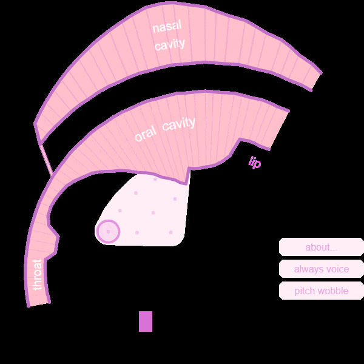

# Pink trombone audios

#### Authors: Mateo Cámara, Zhiyuan Xu, Yisu Zong, and David Südholt.

#### Abstract: We present a systematic methodology to evaluate the synthesis capability of a simplified model of the vocal tract on non-speech human sounds. The Pink Trombone (PT) model, known for its simplicity and efficiency, is used as a case study. Yawning sounds are used as the non-speech signal of interest. We estimate the control parameters to minimize the difference between real and generated audio. The articulatory parameters are optimized using three strategies: genetic models, neural networks, and derivative-free approximations. We also validated several popular quality metrics as error objective functions. We compared the results in terms of error committed and computational demand. The insights can serve as a benchmark to validate other physical models and signal types.

#### Data: In this paper, six methods have been applied to regenerate human sounds, while each of them has tried 4 different representation of sounds. If you are interested in all the regenerated audio samples, you can find it [here](https://drive.google.com/file/d/1XVN8Mj7LLG5pcYhfVSmhXDV5HdQDJ0eV/view?usp=sharing). And if you are looking for the [Pink Trombone](https://dood.al/pinktrombone/) generated dataset to train neural network, you can find it [here](https://drive.google.com/file/d/1bA0rWwonPMUb6FpfO0tIQCOvA4rBXyKn/view?usp=sharing).

## Pink Trombone audios without variation (4.1)

## Pink Trombone audios without variation with Gaussian Noise (4.1)

PLEASE MIND THE VOLUME, IT COULD BE VERY LOUD

    <table>
        <tbody>
            <tr>
                <th></th>    
                <th>40dB</th> 
                <th>20dB</th>
                <th>0dB</th>
                <th>-10dB</th>
            </tr>
            <tr>
                <td>original</td>
                <td><audio controls=''><source src='orig_noise/noisy_0_40db.wav'></audio></td>
                <td><audio controls=''><source src='orig_noise/noisy_0_20db.wav'></audio></td>
                <td><audio controls=''><source src='orig_noise/noisy_0_0db.wav'></audio></td>
                <td><audio controls=''><source src='orig_noise/noisy_0_-10db.wav'></audio></td>
            </tr>
            <tr>
                <td>GA_mel</td>
                <td><audio controls=''><source src='results_noise/0_gen_mel_40db.wav'></audio></td>
                <td><audio controls=''><source src='results_noise/0_gen_mel_20db.wav'></audio></td>
                <td><audio controls=''><source src='results_noise/0_gen_mel_0db.wav'></audio></td>
                <td><audio controls=''><source src='results_noise/0_gen_mel_-10db.wav'></audio></td>
            </tr>
            <tr>
                <td>GA_mfcc</td>
                <td><audio controls=''><source src='results_noise/0_gen_mfcc_40db.wav'></audio></td>
                <td><audio controls=''><source src='results_noise/0_gen_mfcc_20db.wav'></audio></td>
                <td><audio controls=''><source src='results_noise/0_gen_mfcc_0db.wav'></audio></td>
                <td><audio controls=''><source src='results_noise/0_gen_mfcc_-10db.wav'></audio></td>
            </tr>
            <tr>
                <td>GA_stft</td>
                <td><audio controls=''><source src='results_noise/0_gen_stft_40db.wav'></audio></td>
                <td><audio controls=''><source src='results_noise/0_gen_stft_20db.wav'></audio></td>
                <td><audio controls=''><source src='results_noise/0_gen_stft_0db.wav'></audio></td>
                <td><audio controls=''><source src='results_noise/0_gen_stft_-10db.wav'></audio></td>
            </tr>
            <tr>
                <td>GA_multiscale</td>
                <td><audio controls=''><source src='results_noise/0_gen_multiscale_40db.wav'></audio></td>
                <td><audio controls=''><source src='results_noise/0_gen_multiscale_20db.wav'></audio></td>
                <td><audio controls=''><source src='results_noise/0_gen_multiscale_0db.wav'></audio></td>
                <td><audio controls=''><source src='results_noise/0_gen_multiscale_-10db.wav'></audio></td>
            </tr>
            <tr>
                <td>PSO_mel</td>
                <td><audio controls=''><source src='results_noise/0_pso_mel_40db.wav'></audio></td>
                <td><audio controls=''><source src='results_noise/0_pso_mel_20db.wav'></audio></td>
                <td><audio controls=''><source src='results_noise/0_pso_mel_0db.wav'></audio></td>
                <td><audio controls=''><source src='results_noise/0_pso_mel_-10db.wav'></audio></td>
            </tr>
            <tr>
                <td>PSO_mfcc</td>
                <td><audio controls=''><source src='results_noise/0_pso_mfcc_40db.wav'></audio></td>
                <td><audio controls=''><source src='results_noise/0_pso_mfcc_20db.wav'></audio></td>
                <td><audio controls=''><source src='results_noise/0_pso_mfcc_0db.wav'></audio></td>
                <td><audio controls=''><source src='results_noise/0_pso_mfcc_-10db.wav'></audio></td>
            </tr>
            <tr>
                <td>PSO_stft</td>
                <td><audio controls=''><source src='results_noise/0_pso_stft_40db.wav'></audio></td>
                <td><audio controls=''><source src='results_noise/0_pso_stft_20db.wav'></audio></td>
                <td><audio controls=''><source src='results_noise/0_pso_stft_0db.wav'></audio></td>
                <td><audio controls=''><source src='results_noise/0_pso_stft_-10db.wav'></audio></td>
            </tr>
            <tr>
                <td>PSO_multiscale</td>
                <td><audio controls=''><source src='results_noise/0_pso_multiscale_40db.wav'></audio></td>
                <td><audio controls=''><source src='results_noise/0_pso_multiscale_20db.wav'></audio></td>
                <td><audio controls=''><source src='results_noise/0_pso_multiscale_0db.wav'></audio></td>
                <td><audio controls=''><source src='results_noise/0_pso_multiscale_-10db.wav'></audio></td>
            </tr>
            <tr>
                <td>TRF_mel</td>
                <td><audio controls=''><source src='results_noise/0_levenberg-marquardt_mel_40db.wav'></audio></td>
                <td><audio controls=''><source src='results_noise/0_levenberg-marquardt_mel_20db.wav'></audio></td>
                <td><audio controls=''><source src='results_noise/0_levenberg-marquardt_mel_0db.wav'></audio></td>
                <td><audio controls=''><source src='results_noise/0_levenberg-marquardt_mel_-10db.wav'></audio></td>
            </tr>
            <tr>
                <td>TRF_mfcc</td>
                <td><audio controls=''><source src='results_noise/0_levenberg-marquardt_mfcc_40db.wav'></audio></td>
                <td><audio controls=''><source src='results_noise/0_levenberg-marquardt_mfcc_20db.wav'></audio></td>
                <td><audio controls=''><source src='results_noise/0_levenberg-marquardt_mfcc_0db.wav'></audio></td>
                <td><audio controls=''><source src='results_noise/0_levenberg-marquardt_mfcc_-10db.wav'></audio></td>
            </tr>
            <tr>
                <td>TRF_stft</td>
                <td><audio controls=''><source src='results_noise/0_levenberg-marquardt_stft_40db.wav'></audio></td>
                <td><audio controls=''><source src='results_noise/0_levenberg-marquardt_stft_20db.wav'></audio></td>
                <td><audio controls=''><source src='results_noise/0_levenberg-marquardt_stft_0db.wav'></audio></td>
                <td><audio controls=''><source src='results_noise/0_levenberg-marquardt_stft_-10db.wav'></audio></td>
            </tr>
            <tr>
                <td>TRF_multiscale</td>
                <td><audio controls=''><source src='results_noise/0_levenberg-marquardt_multiscale_40db.wav'></audio></td>
                <td><audio controls=''><source src='results_noise/0_levenberg-marquardt_multiscale_20db.wav'></audio></td>
                <td><audio controls=''><source src='results_noise/0_levenberg-marquardt_multiscale_0db.wav'></audio></td>
                <td><audio controls=''><source src='results_noise/0_levenberg-marquardt_multiscale_-10db.wav'></audio></td>
            </tr>
            <tr>
                <td>NM_mel</td>
                <td><audio controls=''><source src='results_noise/0_downhill_mel_40db.wav'></audio></td>
                <td><audio controls=''><source src='results_noise/0_downhill_mel_20db.wav'></audio></td>
                <td><audio controls=''><source src='results_noise/0_downhill_mel_0db.wav'></audio></td>
                <td><audio controls=''><source src='results_noise/0_downhill_mel_-10db.wav'></audio></td>
            </tr>
            <tr>
                <td>NM_mfcc</td>
                <td><audio controls=''><source src='results_noise/0_downhill_mfcc_40db.wav'></audio></td>
                <td><audio controls=''><source src='results_noise/0_downhill_mfcc_20db.wav'></audio></td>
                <td><audio controls=''><source src='results_noise/0_downhill_mfcc_0db.wav'></audio></td>
                <td><audio controls=''><source src='results_noise/0_downhill_mfcc_-10db.wav'></audio></td>
            </tr>
            <tr>
                <td>NM_stft</td>
                <td><audio controls=''><source src='results_noise/0_downhill_stft_40db.wav'></audio></td>
                <td><audio controls=''><source src='results_noise/0_downhill_stft_20db.wav'></audio></td>
                <td><audio controls=''><source src='results_noise/0_downhill_stft_0db.wav'></audio></td>
                <td><audio controls=''><source src='results_noise/0_downhill_stft_-10db.wav'></audio></td>
            </tr>
            <tr>
                <td>NM_multiscale</td>
                <td><audio controls=''><source src='results_noise/0_downhill_multiscale_40db.wav'></audio></td>
                <td><audio controls=''><source src='results_noise/0_downhill_multiscale_20db.wav'></audio></td>
                <td><audio controls=''><source src='results_noise/0_downhill_multiscale_0db.wav'></audio></td>
                <td><audio controls=''><source src='results_noise/0_downhill_multiscale_-10db.wav'></audio></td>
            </tr>
            <tr>
                <td>CMA-ES_mel</td>
                <td><audio controls=''><source src='results_noise/0_cma-es_mel_40db.wav'></audio></td>
                <td><audio controls=''><source src='results_noise/0_cma-es_mel_20db.wav'></audio></td>
                <td><audio controls=''><source src='results_noise/0_cma-es_mel_0db.wav'></audio></td>
                <td><audio controls=''><source src='results_noise/0_cma-es_mel_-10db.wav'></audio></td>
            </tr>
            <tr>
                <td>CMA-ES_mfcc</td>
                <td><audio controls=''><source src='results_noise/0_cma-es_mfcc_40db.wav'></audio></td>
                <td><audio controls=''><source src='results_noise/0_cma-es_mfcc_20db.wav'></audio></td>
                <td><audio controls=''><source src='results_noise/0_cma-es_mfcc_0db.wav'></audio></td>
                <td><audio controls=''><source src='results_noise/0_cma-es_mfcc_-10db.wav'></audio></td>
            </tr>
            <tr>
                <td>CMA-ES_stft</td>
                <td><audio controls=''><source src='results_noise/0_cma-es_stft_40db.wav'></audio></td>
                <td><audio controls=''><source src='results_noise/0_cma-es_stft_20db.wav'></audio></td>
                <td><audio controls=''><source src='results_noise/0_cma-es_stft_0db.wav'></audio></td>
                <td><audio controls=''><source src='results_noise/0_cma-es_stft_-10db.wav'></audio></td>
            </tr>
            <tr>
                <td>CMA-ES_multiscale</td>
                <td><audio controls=''><source src='results_noise/0_cma-es_multiscale_40db.wav'></audio></td>
                <td><audio controls=''><source src='results_noise/0_cma-es_multiscale_20db.wav'></audio></td>
                <td><audio controls=''><source src='results_noise/0_cma-es_multiscale_0db.wav'></audio></td>
                <td><audio controls=''><source src='results_noise/0_cma-es_multiscale_-10db.wav'></audio></td>
            </tr>
            <tr>
                <td>NN_mel</td>
                <td><audio controls=''><source src='results_noise/0_nn_mel_40db.wav'></audio></td>
                <td><audio controls=''><source src='results_noise/0_nn_mel_20db.wav'></audio></td>
                <td><audio controls=''><source src='results_noise/0_nn_mel_0db.wav'></audio></td>
                <td><audio controls=''><source src='results_noise/0_nn_mel_-10db.wav'></audio></td>
            </tr>
            <tr>
                <td>NN_mfcc</td>
                <td><audio controls=''><source src='results_noise/0_nn_mfcc_40db.wav'></audio></td>
                <td><audio controls=''><source src='results_noise/0_nn_mfcc_20db.wav'></audio></td>
                <td><audio controls=''><source src='results_noise/0_nn_mfcc_0db.wav'></audio></td>
                <td><audio controls=''><source src='results_noise/0_nn_mfcc_-10db.wav'></audio></td>
            </tr>
            <tr>
                <td>NN_stft</td>
                <td><audio controls=''><source src='results_noise/0_nn_stft_40db.wav'></audio></td>
                <td><audio controls=''><source src='results_noise/0_nn_stft_20db.wav'></audio></td>
                <td><audio controls=''><source src='results_noise/0_nn_stft_0db.wav'></audio></td>
                <td><audio controls=''><source src='results_noise/0_nn_stft_-10db.wav'></audio></td>
            </tr>
            <tr>
                <td>NN_multiscale</td>
                <td><audio controls=''><source src='results_noise/0_nn_multiscale_40db.wav'></audio></td>
                <td><audio controls=''><source src='results_noise/0_nn_multiscale_20db.wav'></audio></td>
                <td><audio controls=''><source src='results_noise/0_nn_multiscale_0db.wav'></audio></td>
                <td><audio controls=''><source src='results_noise/0_nn_multiscale_-10db.wav'></audio></td>
            </tr>
        </tbody>
    </table>

    

## Pink Trombone audios with variation (4.2)

    <table>
        <tbody>
            <tr>
                <th></th>
                <th>vowel /a/</th>
                <th>vowel /o/</th>
                <th>yawn 1</th>
            </tr>
            <tr>
                <td>original</td>
                <td><audio controls=''><source src='orig_real/a.wav'></audio></td>
                <td><audio controls=''><source src='orig_real/o.wav'></audio></td>
                <td><audio controls=''><source src='orig_real/yawn1.wav'></audio></td>
            </tr>
            <tr>
                <td>GA_mel</td>
                <td><audio controls=''><source src='results_real/a_gen_mel.wav'></audio></td>
                <td><audio controls=''><source src='results_real/o_gen_mel.wav'></audio></td>
                <td><audio controls=''><source src='results_real/yawn1_gen_mel.wav'></audio></td>
            </tr>
            <tr>
                <td>GA_mfcc</td>
                <td><audio controls=''><source src='results_real/a_gen_mfcc.wav'></audio></td>
                <td><audio controls=''><source src='results_real/o_gen_mfcc.wav'></audio></td>
                <td><audio controls=''><source src='results_real/yawn1_gen_mfcc.wav'></audio></td>
            </tr>
            <tr>
                <td>GA_stft</td>
                <td><audio controls=''><source src='results_real/a_gen_stft.wav'></audio></td>
                <td><audio controls=''><source src='results_real/o_gen_stft.wav'></audio></td>
                <td><audio controls=''><source src='results_real/yawn1_gen_stft.wav'></audio></td>
            </tr>
            <tr>
                <td>GA_multiscale</td>
                <td><audio controls=''><source src='results_real/a_gen_multiscale.wav'></audio></td>
                <td><audio controls=''><source src='results_real/o_gen_multiscale.wav'></audio></td>
                <td><audio controls=''><source src='results_real/yawn1_gen_multiscale.wav'></audio></td>
            </tr>
            <tr>
                <td>PSO_mel</td>
                <td><audio controls=''><source src='results_real/a_pso_mel.wav'></audio></td>
                <td><audio controls=''><source src='results_real/o_pso_mel.wav'></audio></td>
                <td><audio controls=''><source src='results_real/yawn1_pso_mel.wav'></audio></td>
            </tr>
            <tr>
                <td>PSO_mfcc</td>
                <td><audio controls=''><source src='results_real/a_pso_mfcc.wav'></audio></td>
                <td><audio controls=''><source src='results_real/o_pso_mfcc.wav'></audio></td>
                <td><audio controls=''><source src='results_real/yawn1_pso_mfcc.wav'></audio></td>
            </tr>
            <tr>
                <td>PSO_stft</td>
                <td><audio controls=''><source src='results_real/a_pso_stft.wav'></audio></td>
                <td><audio controls=''><source src='results_real/o_pso_stft.wav'></audio></td>
                <td><audio controls=''><source src='results_real/yawn1_pso_stft.wav'></audio></td>
            </tr>
            <tr>
                <td>PSO_multiscale</td>
                <td><audio controls=''><source src='results_real/a_pso_multiscale.wav'></audio></td>
                <td><audio controls=''><source src='results_real/o_pso_multiscale.wav'></audio></td>
                <td><audio controls=''><source src='results_real/yawn1_pso_multiscale.wav'></audio></td>
            </tr>
            <tr>
                <td>TRF_mel</td>
                <td><audio controls=''><source src='results_real/a_levenberg-marquardt_mel.wav'></audio></td>
                <td><audio controls=''><source src='results_real/o_levenberg-marquardt_mel.wav'></audio></td>
                <td><audio controls=''><source src='results_real/yawn1_levenberg-marquardt_mel.wav'></audio></td>
            </tr>
            <tr>
                <td>TRF_mfcc</td>
                <td><audio controls=''><source src='results_real/a_levenberg-marquardt_mfcc.wav'></audio></td>
                <td><audio controls=''><source src='results_real/o_levenberg-marquardt_mfcc.wav'></audio></td>
                <td><audio controls=''><source src='results_real/yawn1_levenberg-marquardt_mfcc.wav'></audio></td>
            </tr>
            <tr>
                <td>TRF_stft</td>
                <td><audio controls=''><source src='results_real/a_levenberg-marquardt_stft.wav'></audio></td>
                <td><audio controls=''><source src='results_real/o_levenberg-marquardt_stft.wav'></audio></td>
                <td><audio controls=''><source src='results_real/yawn1_levenberg-marquardt_stft.wav'></audio></td>
            </tr>
            <tr>
                <td>TRF_multiscale</td>
                <td><audio controls=''><source src='results_real/a_levenberg-marquardt_multiscale.wav'></audio></td>
                <td><audio controls=''><source src='results_real/o_levenberg-marquardt_multiscale.wav'></audio></td>
                <td><audio controls=''><source src='results_real/yawn1_levenberg-marquardt_multiscale.wav'></audio></td>
            </tr>
            <tr>
                <td>NM_mel</td>
                <td><audio controls=''><source src='results_real/a_downhill_mel.wav'></audio></td>
                <td><audio controls=''><source src='results_real/o_downhill_mel.wav'></audio></td>
                <td><audio controls=''><source src='results_real/yawn1_downhill_mel.wav'></audio></td>
            </tr>
            <tr>
                <td>NM_mfcc</td>
                <td><audio controls=''><source src='results_real/a_downhill_mfcc.wav'></audio></td>
                <td><audio controls=''><source src='results_real/o_downhill_mfcc.wav'></audio></td>
                <td><audio controls=''><source src='results_real/yawn1_downhill_mfcc.wav'></audio></td>
            </tr>
            <tr>
                <td>NM_stft</td>
                <td><audio controls=''><source src='results_real/a_downhill_stft.wav'></audio></td>
                <td><audio controls=''><source src='results_real/o_downhill_stft.wav'></audio></td>
                <td><audio controls=''><source src='results_real/yawn1_downhill_stft.wav'></audio></td>
            </tr>
            <tr>
                <td>NM_multiscale</td>
                <td><audio controls=''><source src='results_real/a_downhill_multiscale.wav'></audio></td>
                <td><audio controls=''><source src='results_real/o_downhill_multiscale.wav'></audio></td>
                <td><audio controls=''><source src='results_real/yawn1_downhill_multiscale.wav'></audio></td>
            </tr>
            <tr>
                <td>CMA-ES_mel</td>
                <td><audio controls=''><source src='results_real/a_cma-es_mel.wav'></audio></td>
                <td><audio controls=''><source src='results_real/o_cma-es_mel.wav'></audio></td>
                <td><audio controls=''><source src='results_real/yawn1_cma-es_mel.wav'></audio></td>
            </tr>
            <tr>
                <td>CMA-ES_mfcc</td>
                <td><audio controls=''><source src='results_real/a_cma-es_mfcc.wav'></audio></td>
                <td><audio controls=''><source src='results_real/o_cma-es_mfcc.wav'></audio></td>
                <td><audio controls=''><source src='results_real/yawn1_cma-es_mfcc.wav'></audio></td>
            </tr>
            <tr>
                <td>CMA-ES_stft</td>
                <td><audio controls=''><source src='results_real/a_cma-es_stft.wav'></audio></td>
                <td><audio controls=''><source src='results_real/o_cma-es_stft.wav'></audio></td>
                <td><audio controls=''><source src='results_real/yawn1_cma-es_stft.wav'></audio></td>
            </tr>
            <tr>
                <td>CMA-ES_multiscale</td>
                <td><audio controls=''><source src='results_real/a_cma-es_multiscale.wav'></audio></td>
                <td><audio controls=''><source src='results_real/o_cma-es_multiscale.wav'></audio></td>
                <td><audio controls=''><source src='results_real/yawn1_cma-es_multiscale.wav'></audio></td>
            </tr>
            <tr>
                <td>NN_mel</td>
                <td><audio controls=''><source src='results_real/a_nn_mel.wav'></audio></td>
                <td><audio controls=''><source src='results_real/o_nn_mel.wav'></audio></td>
                <td><audio controls=''><source src='results_real/yawn1_nn_mel.wav'></audio></td>
            </tr>
            <tr>
                <td>NN_mfcc</td>
                <td><audio controls=''><source src='results_real/a_nn_mfcc.wav'></audio></td>
                <td><audio controls=''><source src='results_real/o_nn_mfcc.wav'></audio></td>
                <td><audio controls=''><source src='results_real/yawn1_nn_mfcc.wav'></audio></td>
            </tr>
            <tr>
                <td>NN_stft</td>
                <td><audio controls=''><source src='results_real/a_nn_stft.wav'></audio></td>
                <td><audio controls=''><source src='results_real/o_nn_stft.wav'></audio></td>
                <td><audio controls=''><source src='results_real/yawn1_nn_stft.wav'></audio></td>
            </tr>
            <tr>
                <td>NN_multiscale</td>
                <td><audio controls=''><source src='results_real/a_nn_multiscale.wav'></audio></td>
                <td><audio controls=''><source src='results_real/o_nn_multiscale.wav'></audio></td>
                <td><audio controls=''><source src='results_real/yawn1_nn_multiscale.wav'></audio></td>
            </tr>
        </tbody>
    </table>

        
        
        
## Some Interesting trials
#### Trial One
#### Based on the outputs of optimization, which are the values of each control parameter, we not only fed it back to Pink Trombone to generate audio, GIF files are also generated to see how each part of vocal tract moves. 
#### For example, the GIF file of a yawn is shown below. (Movements have been slown down to catch details)
<audio controls=''><source src='others/yawn5.wav'></audio>

#### Trial Two
#### We tried NN_stft on regenerating a Chinese song which was popular on TikTok.
Original version: <audio controls=''><source src='others/chinese-man-singing.wav'></audio>
Regenerated version: <audio controls=''><source src='others/chinese-man-singing_regen.wav'></audio>
